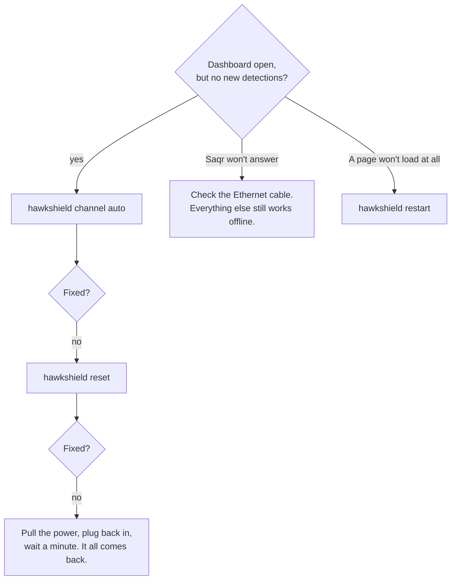

<div align="center">

<picture>
  <source media="(prefers-color-scheme: dark)" srcset="frontend/public/hawkshield-mark-dark.png">
  
</picture>

# Starting HawkShield

**You have been handed a Raspberry Pi with HawkShield on it. This is how you make it sing —**
**even if you have never seen the project before.**


</div>

---

> [!IMPORTANT]
> **You do not *start* HawkShield. It starts itself.**
>
> Capture, the machine-learning model, and the dashboard are all system services set to launch
> at boot. **Plug the Pi in, wait about a minute, and the whole thing is already running** — and it
> comes back the same way after any reboot, power cut, or someone tripping over the cable. There is
> no server to launch in a terminal and nothing to leave running in a window. If you close your
> laptop and walk away, it keeps working.
>
> Everything below is for the *two* things that actually need a human: **telling it which Wi-Fi to
> watch**, and **checking it is healthy** before an audience does.

---

## The thirty-second version

<div align="center">

| # | Do this | Why |
|:-:|---|---|
| **1** | Plug in **Ethernet** + power. Wait ~1 min. | Ethernet feeds the internet the AI analyst needs. Everything auto-starts. |
| **2** | `hawkshield wifi <network>` | Put the Pi on the network you want to watch. |
| **3** | `hawkshield channel auto` | **The step everyone forgets.** Aim the radio at that network's channel. |
| **4** | `hawkshield` | Confirm every line is green, then open the dashboard. |

**Then open → [`http://pi.local:8000`](http://pi.local:8000)**

</div>

That is the entire job. The rest of this page explains each step for the first time you do it, and
tells you what to do when a light goes red.

---

## Step 0 · Get in

Everything is driven from one place: an SSH session to the Pi.

```bash
ssh pi@pi.local
```

The moment you connect, the Pi greets you with the same cheat-sheet that's on this page — so you
never have to remember it. If `pi.local` doesn't resolve on a locked-down network, the Pi's numeric
address works too; `hawkshield` prints it.

---

## Step 1 · Look before you touch — `hawkshield`

One command tells you everything. Run it. It reads only; it changes nothing; it is always safe.

```bash
hawkshield
```

```text
  HawkShield  Sat 29 Aug 02:06

  Services
    ✓ hawkshield-api (active, enabled at boot)
    ✓ hawkshield-detector (active, enabled at boot)

  Capture
    ✓ wlan1 in monitor mode, channel 9
    ✓ hearing traffic (119 frames in 8s)

  Detections
    ✓ stored 1,196 · model v2-gbdt · spec 2.1.0

  Network
    ✓ eth0  192.168.3.90/24  <- internet
    ✓ wlan0 on 'office-wifi' ch 9 -- 'channel auto' follows this

  Saqr
    ✓ model provider reachable
    ✓ operator tools enabled

  Open the dashboard
    http://pi.local:8000   (works even when the IP changes)
```

Read it top to bottom. **Green is good.** The three lines that decide whether a demo goes well:

- **Capture → hearing traffic.** This is the whole point. If it says *silent*, the radio is on the
  wrong channel or has stalled — Step 3 and the rescue table below fix it.
- **Network → eth0 `<- internet`.** The AI analyst is a cloud model; without internet it politely
  says so and everything *else* still works.
- **Saqr → model provider reachable.** Same story, confirmed.

---

## Step 2 · Choose what to watch — `hawkshield wifi`

HawkShield listens to one Wi-Fi network at a time. Tell it which:

```bash
hawkshield wifi "The-Network-Name"
```

It asks for the password (typed, never shown, never stored in your shell history) and joins on the
spare radio. Now the Pi *knows* the network you care about — which matters for the next step.

> [!TIP]
> Demoing against your own pocket router that the Pi already remembers? You can skip straight to
> Step 3. And if you happen to know the channel number by heart, skip to `hawkshield channel <n>`.

---

## Step 3 · Aim the radio — `hawkshield channel auto`

> [!CAUTION]
> **This is the one step that quietly ruins demos.**
>
> A Wi-Fi sensor only hears the channel it is tuned to. Access points wander between channels on
> their own — a router can be on channel 11 one day and 9 the next — and when that happens the
> sensor reports *monitor mode: on, link: up, healthy* while hearing **absolutely nothing**. Every
> light is green and the dashboard never moves.

One command makes the problem impossible:

```bash
hawkshield channel auto
```

It reads the channel the network from Step 2 is *actually* on and tunes the capture radio to match.
Run it after you join a network, and any time the live tape goes quiet. There is no guessing.

---

## Step 4 · Confirm, then show it off

```bash
hawkshield
```

All green? Open the dashboard on the projector:

<div align="center">

### → [`http://pi.local:8000`](http://pi.local:8000) ←

</div>

That address follows the Pi even when the venue's network hands it a different IP, so it is the one
to trust.

| Page | What's there |
|---|---|
| **`/`** | The one-screen overview — what the sensor has seen, at a glance |
| **`/dashboard`** | The live tape. New detections land here in real time |
| **`/threats`** | The full searchable log, every detection with its detail |
| **`/map`** | Where the strongest sources are, by signal trilateration |
| **`/saqr`** | Ask the sensor a question, in English or Arabic — it answers by querying its own data |
| **`/admin`** | Operator controls (unlisted). Simulate traffic, and the reset button |

---

## Showing an attack

Two ways, depending on whether you can transmit in the room.

<table>
<tr>
<td width="50%" valign="top">

### 🛰️ Real — over the air

From the repo on the Pi:

```bash
./attack/attack.sh
```

Transmits genuine 802.11 attack frames at **your own** router; the sensor catches them off the air
seconds later. Watch `/dashboard`. See [`attack/README.md`](attack/README.md) for the attack
classes and options.

*This is the honest version — the frames really flew.*

</td>
<td width="50%" valign="top">

### 🎛️ Fallback — no radio needed

On the **`/admin`** page, the **Simulate** panel replays real frames through the live model in
software. No transmitting, always works.

Use this when the room won't let you put attack frames on the air, or as a rehearsal.

*The detections are real model output; only the delivery is simulated.*

</td>
</tr>
</table>

> [!TIP]
> **Start the board clean.** Before an audience, wipe the practice data so the first attack you show
> is unmistakably live: **`/admin` → Delete all detections** (a red button; type `DELETE` to confirm).
> Every chart drops to zero.

---

## When a light goes red

Nothing here needs a rebuild or a reinstall. It is always one of these:



| Symptom | Fix |
|---|---|
| Dashboard is up, but detections aren't moving | `hawkshield channel auto` — the Wi-Fi likely changed channel |
| Still nothing, and `hawkshield` says **radio is silent** | `hawkshield reset` — the USB adapter stalled; this fixes it every time |
| Saqr says it isn't configured / gives no answer | It needs internet. Check the Ethernet. Everything else runs offline |
| A page won't load at all | `hawkshield restart` |
| Truly stuck | Pull the power, plug it back in, wait a minute. Everything returns on its own |

> [!NOTE]
> **"Sensor idle · last packet N hours ago" is not an error.** HawkShield only *stores* attacks —
> ordinary Wi-Fi traffic is classified and thrown away. The sensor is listening the entire time;
> `hawkshield` shows you the live frame count to prove it. A quiet board just means nobody is
> attacking the network yet. Fire Step *"Showing an attack"* and watch it wake up.

---

## The whole command, in one table

<div align="center">

| Command | What it does |
|---|---|
| `hawkshield` | Full status — services, capture, detections, network, and the URL. Always safe. |
| `hawkshield channel auto` | Tune the radio to the channel your Wi-Fi is on. |
| `hawkshield wifi <SSID>` | Join a network to watch it. |
| `hawkshield reset` | Un-stick the capture adapter if the radio goes silent. |
| `hawkshield restart` | Restart both services. |
| `hawkshield logs` | Watch the detector think, live. |
| `hawkshield hotspot` | Serve a network from the Pi when the venue gives you none. |

</div>

---

<div align="center">

**That's it. Plug in, point it at a network, open the page.**

*Everything else the Pi already knows how to do by itself.*

</div>
