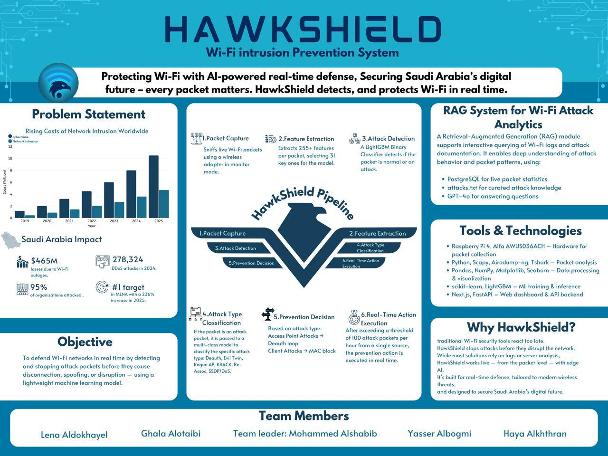

# HawkShield

**Wi-Fi intrusion *detection* for the Raspberry Pi 4** — monitor-mode 802.11 capture, a two-stage
LightGBM classifier, a PostgreSQL attack log, and a dashboard plus natural-language assistant served
from a single FastAPI process. One launcher, `python run.py`, runs it on the Pi or on a laptop.


> **Scope note — this is an IDS, not an IPS.** HawkShield observes, classifies, stores and presents.
> It does **not** disconnect clients, block MACs, talk to a WLAN controller, or send alerts. Earlier
> descriptions of this project claimed "real-time prevention" and an email-report endpoint; neither
> exists in this codebase. See [Roadmap — not yet implemented](#roadmap--not-yet-implemented).

> **Model status — read before trusting a label.** The pipeline works; the shipped models leak.
> Stage 1 depends heavily on `frame.time_relative`, a capture-session artefact, and stage 2 currently
> answers `Krack` for every frame of every sample capture. Details and the reproduction command are in
> [Model status](#model-status--known-training-data-leakage) and, in full, in
> [`models/README.md` §5](models/README.md).



---

## Quickstart — one command

```bash
python run.py
```

`run.py` is the only thing you have to run. It works out where it is, checks everything that can go
wrong before it goes wrong, and starts the right processes for that machine:

| Detected | What starts | Database |
|---|---|---|
| **Raspberry Pi** — `/proc/device-tree/model`, then Linux + `aarch64` / `armv7l` | detector (live 802.11 capture) **+** API **+** dashboard | PostgreSQL, **required** — the launcher refuses to start without one |
| **Anything else** — laptop | API **+** dashboard, reading whatever is already in the database | PostgreSQL if configured, otherwise a local SQLite file it creates for you |

That split is the whole point: **the same checkout runs on both machines, with no config edits on the
laptop.** Use the project's own interpreter — `.venv/bin/python run.py`, or
`.venv/Scripts/python.exe run.py` on Windows — and run it **from the repo root**.

### At the conference — the laptop demo, two commands

```bash
python backend/scripts/check_rag.py     # optional pre-flight: proves the /ask assistant will answer
python run.py --demo                    # replay a sample attack capture, then serve the dashboard
```

Open the URL it prints. Nothing to install, configure, or start by hand — no database, no `.env`
edit, no radio.

```
  HawkShield
  Windows AMD64
  detected: LAPTOP

-- checks ------------------------------------------------------------
  OK    .env found
  WARN  no usable DATABASE_URL -- using a local SQLite file for this session
        sqlite:///D:/HawkShield/hawkshield.db
  OK    model bundles present
  OK    dashboard build found (frontend/out)
  OK    database reachable, schema ready

-- demo data ---------------------------------------------------------
        replaying assoc_flood_raw_decrypted.pcapng (1500 frames) into the database...
        persisted (p2>=0.80): 592 (39.47%)

-- starting ----------------------------------------------------------
        detector off -- dashboard reads existing data only

  Dashboard   http://localhost:8000
              http://192.168.3.11:8000   (from another device on this network)
  API docs    http://localhost:8000/docs
  Health      http://localhost:8000/health

  Ctrl-C to stop
```

*(that run was `python run.py --demo --demo-frames 1500`; the default is 4000 frames)*

### What it does before starting anything

1. Creates `.env` from `.env.example` if it is missing.
2. Picks a database. If `DATABASE_URL` is unset or still contains `CHANGE_ME`: **laptop** mode falls
   back to a local SQLite file (`hawkshield.db` in the repo root) and says so; **Pi** mode stops with
   exit 2 and tells you to configure PostgreSQL.
3. Checks both model bundles are in `models/`.
4. Checks for a dashboard build at `frontend/out` — warns, does not fail, if there is none.
5. Runs the schema migration (`python -m backend.scripts.init_db`).
6. Checks the port is free, and suggests the next one if it is not.
7. On the Pi, checks for root. Without it, the detector cannot open a raw socket, so it falls back to
   dashboard-only and prints the `sudo` hint.

Then it prints the dashboard URL, the LAN URL to open on a phone, `/docs` and `/health`.
**Ctrl-C stops everything cleanly.**

### Flags

| Flag | Default | Effect |
|---|---|---|
| `--mode auto\|pi\|laptop` | `auto` | override the detection — e.g. force laptop behaviour on the Pi |
| `--host` | `0.0.0.0` | bind address |
| `--port` | `8000` | serve somewhere else |
| `--demo` | off | replay a sample capture into the database before starting |
| `--demo-capture PATH` | `data/samples/assoc_flood_raw_decrypted.pcapng` | which capture `--demo` replays |
| `--demo-frames N` | `4000` | how many frames `--demo` replays |
| `--detector` / `--no-detector` | on for Pi, off for laptop | force live capture on or off |
| `--iface` / `--channel` | from `.env` | passed straight to the detector CLI |
| `--reload` | off | uvicorn auto-reload, for development |

The systemd path is still the right answer for an unattended Pi — see
[Full Raspberry Pi install](#full-raspberry-pi-install-systemd).

---

## Contents

| Document | What is in it |
|---|---|
| [`docs/architecture.md`](docs/architecture.md) | Frame-by-frame data flow, the two-stage design, why one process serves both API and UI |
| [`docs/deployment-pi.md`](docs/deployment-pi.md) | Full Raspberry Pi walkthrough — OS, adapter, PostgreSQL, systemd, verification |
| [`docs/api.md`](docs/api.md) | Every endpoint, with parameters and real example responses |
| [`docs/models.md`](docs/models.md) | Pipeline, classes, thresholds, feature space — short; points at the model card |
| [`models/README.md`](models/README.md) | Full model card, bundle internals, **and the leakage analysis** |
| [`deploy/README.md`](deploy/README.md) | Operator runbook: installer flags, day-to-day commands, troubleshooting |
| [`frontend/README.md`](frontend/README.md) | Dashboard pages, static-export build, offline map behaviour |
| [`data/README.md`](data/README.md) | The six sample captures and the external training dataset |
| [`docs/CONTRACT.md`](docs/CONTRACT.md) | Normative interface contract (schema, env vars, HTTP shapes, bundle layout) |

---

## Features

| | Capability | Where |
|---|---|---|
| 📡 | **Monitor-mode capture** — scapy `sniff(store=False)` on a pinned channel, with ENETDOWN recovery and a 2 s heartbeat | `backend/detector/capture.py` |
| 🧮 | **Honest feature extraction** — 29 numeric 802.11/RadioTap features per frame; a field the frame does not carry stays `None` and is imputed by the bundle, never invented | `backend/detector/features.py` |
| 🔍 | **Stage 1 — binary** LightGBM `P(attack)` against `STAGE1_THRESHOLD` (0.40) | `backend/detector/pipeline.py` |
| 🏷️ | **Stage 2 — multiclass** LightGBM over six labels (`SSDP`, `Evil_Twin`, `Krack`, `Deauth`, `(Re)Assoc`, `RogueAP`) with a `STAGE2_THRESHOLD` (0.80) confidence floor | `backend/detector/pipeline.py` |
| 💾 | **Attack-only persistence** — batched inserts into PostgreSQL `packets`; normal traffic is classified and dropped | `backend/detector/sink.py` |
| 🌐 | **Analytics API** — counts, per-label breakdown, top offenders, channel usage, day×hour heatmap | `backend/app/routers/attacks.py` |
| 🗺️ | **Map utilities** — AP inventory, per-source average RSSI, RSSI-weighted centroid origin estimate | `backend/app/routers/maps.py` |
| 🧾 | **Reports** — JSON summary and a one-page A4 PDF export (ReportLab) | `backend/app/routers/reports.py` |
| 🧠 | **`/ask` assistant (optional)** — text-to-SQL over `packets` plus Q&A from a bundled attack knowledge base, through **OpenRouter** (default model DeepSeek V4 Flash); dialect-aware (PostgreSQL on the Pi, SQLite on a laptop demo), read-only `SELECT` enforcement, row cap and statement timeout | `backend/app/rag/packet_qa.py` |
| 🖥️ | **Dashboard** — Next.js 15 static export served by FastAPI itself at `/`, same-origin, no second web server | `frontend/` |
| 🔁 | **Offline replay** — score any `.pcapng` through the exact live code path, no radio required | `backend/scripts/replay_pcap.py` |
| 🚀 | **One launcher** — auto-detects Pi vs laptop, preflights `.env`/database/models/build/port, starts what that machine needs | `run.py` |

---

## Architecture

```
                Raspberry Pi 4  (Raspberry Pi OS Bookworm, Python 3.11)
   ┌──────────────────────────────────────────────────────────────────────┐
   │                                                                      │
   │  USB Wi-Fi adapter (wlan1, monitor mode, pinned channel)             │
   │            │                                                         │
   │            │  802.11 frames + RadioTap                               │
   │            ▼                                                         │
   │  ┌───────────────────────── hawkshield-detector.service (root) ───┐  │
   │  │  scapy sniff  →  packet_to_row()  →  29 numeric features       │  │
   │  │                          │                                     │  │
   │  │                          ▼                                     │  │
   │  │        stage 1  LightGBM binary   p1 = P(attack)               │  │
   │  │                   p1 < 0.40 ──────────────► drop (not stored)  │  │
   │  │                          │ p1 ≥ 0.40                           │  │
   │  │                          ▼                                     │  │
   │  │        stage 2  LightGBM multiclass  (label, p2)               │  │
   │  │                   p2 < 0.80 ──────────────► drop (not stored)  │  │
   │  │                          │ p2 ≥ 0.80                           │  │
   │  │                          ▼                                     │  │
   │  │              PacketSink  (batch 20 rows / 2.0 s)               │  │
   │  └───────────────────────────┬────────────────────────────────────┘ │
   │                              │ INSERT                               │
   │                              ▼                                      │
   │                    PostgreSQL :5432   table `packets`                │
   │                              ▲                                      │
   │                              │ SELECT                               │
   │  ┌───────────────────────────┴──── hawkshield-api.service ────────┐  │
   │  │  uvicorn :8000                                                 │  │
   │  │    JSON API   /health /attacks /reports/* /map/* /ask …        │  │
   │  │    StaticFiles mount at "/"  →  frontend/out  (Next.js export) │  │
   │  └────────────────────────────────────────────────────────────────┘  │
   │                              ▲                                       │
   └──────────────────────────────┼───────────────────────────────────────┘
                                  │  http://<pi-ip>:8000   (same origin)
                          ┌───────┴────────┐
                          │  laptop browser │
                          └────────────────┘
```

One web process, one port. The API routes are registered first and the static export is mounted last
at `/`, so the catch-all can never shadow an endpoint. Full narrative in
[`docs/architecture.md`](docs/architecture.md).

---

## Hardware

| Item | Requirement |
|---|---|
| Board | Raspberry Pi 4 (4 GB or more recommended), Raspberry Pi OS **Bookworm**, Python 3.11 |
| Storage | microSD ≥ 16 GB, or USB SSD |
| **Capture radio** | **A USB Wi-Fi adapter that supports monitor mode.** |
| Uplink | The Pi's built-in `wlan0` or Ethernet, for management/SSH |

> ⚠️ **The Pi 4's built-in `wlan0` generally cannot do monitor mode.** Its Broadcom/Cypress firmware
> either refuses the mode switch or silently captures nothing. You need a second, external adapter.
> Known-good chipsets: **Atheros AR9271**, **Ralink RT3070 / RT5372**, **MediaTek MT7601U**,
> **Realtek RTL8812AU** with the aircrack-ng driver. It normally enumerates as `wlan1` — confirm with
> `ip -br link`.

The default configuration pins the adapter to **2.4 GHz channel 6**. The adapter's channel,
`CAPTURE_CHANNEL` in `.env`, and the argument given to `monitor_mode.sh` must all agree.

---

## Full Raspberry Pi install (systemd)

`python run.py` is enough to demo on a Pi, and it is what you want when you are standing next to it.
For an unattended sensor that comes back after a reboot, install the two systemd units instead.

Note the one hard difference from the laptop: **the Pi expects PostgreSQL.** There is no SQLite
fallback there — `run.py` exits 2 if `DATABASE_URL` is unset or still says `CHANGE_ME`, rather than
quietly writing a sensor's attack log to a file that nothing backs up.

```bash
# 1. Clone
git clone <your-repo-url> ~/HawkShield
cd ~/HawkShield

# 2. Install. The FIRST run stops on purpose (exit 3) after copying .env.example -> .env,
#    because the installer will not invent a database password.
sudo ./deploy/install_pi.sh

# 3. Configure
nano .env          # set the DATABASE_URL password, confirm CAPTURE_IFACE / CAPTURE_CHANNEL

# 4. Install for real: apt deps, PostgreSQL role + DB, venv, schema, systemd units
sudo ./deploy/install_pi.sh

# 5. Put the capture adapter into monitor mode on the channel you configured
sudo ./deploy/monitor_mode.sh wlan1 6

# 6. Start the two services
sudo systemctl start hawkshield-api
sudo systemctl start hawkshield-detector

# 7. Verify
curl -s http://localhost:8000/health
hostname -I                     # then open http://<pi-ip>:8000 in a browser
```

Steps 5–7 have a launcher equivalent, useful when a unit will not start and you want the output in
front of you — stop `hawkshield-api` first, or port 8000 is taken:

```bash
sudo ./deploy/monitor_mode.sh wlan1 6
sudo .venv/bin/python run.py            # detector + API + dashboard, in the foreground
```

### Build the frontend on a machine with internet

`frontend/out/` is **git-ignored**, so a fresh clone has no dashboard until you build it — and the
build **needs network access**: `app/layout.tsx` imports `Inter` from `next/font/google`, which is
fetched at build time. An offline Pi build fails there.

```bash
# on any networked machine (laptop is fine)
cd frontend && npm ci && npm run build      # -> frontend/out/
# then copy frontend/out/ to the Pi at $FRONTEND_DIST (default <repo>/frontend/out)
```

If the dashboard 404s but `/health` answers, the export is simply missing. See
[`frontend/README.md`](frontend/README.md) for the `NEXT_PUBLIC_API_BASE` caveat before you build.

---

## Laptop / development mode

Nothing about HawkShield requires a Pi except the radio. You can run the whole stack on a laptop and
feed it captures instead of live frames.

```bash
python -m venv .venv
.venv/bin/pip install -r backend/requirements-dev.txt      # runtime + pytest + httpx

.venv/bin/python run.py --demo                             # .env, database, schema, data, server
```

That is the whole setup. `run.py` copies `.env.example` to `.env`, falls back to a SQLite file
because the shipped `DATABASE_URL` still says `CHANGE_ME`, creates the schema and loads sample
attacks. You only need a `DATABASE_URL` of your own if you want the laptop to read the Pi's
PostgreSQL.

Doing it by hand is still supported, and is what `run.py` runs underneath:

```bash
cp .env.example .env
.venv/bin/python -m backend.scripts.init_db                # create the schema
.venv/bin/uvicorn backend.app.main:app --reload --port 8000
```

On Windows use `.venv/Scripts/python.exe`. Run **everything from the repo root** — `backend` is a
package and the module paths (`backend.app.main:app`, `python -m backend.detector.cli`) assume it.
`run.py --reload` is the launcher's equivalent of `uvicorn --reload`.

Two frontend options:

| Mode | Command | `NEXT_PUBLIC_API_BASE` |
|---|---|---|
| Static export served by FastAPI (production shape) | `cd frontend && npm run build` | empty — same origin |
| `next dev` hot reload against a running API | `cd frontend && npm run dev` | `http://localhost:8000` or `http://<pi-ip>:8000` |

`next dev` needs the API's `CORS_ORIGINS` to include `http://localhost:3000` (it does by default).
Interactive API docs are at `http://localhost:8000/docs`.

---

## Endpoints

All routes are registered **without a prefix**. Full request/response detail in
[`docs/api.md`](docs/api.md).

| Method | Path | Purpose |
|---|---|---|
| GET | `/health` | DB reachability, packet count, latest timestamp, model presence, version |
| GET | `/attacks?limit=&offset=` | Raw `packets` rows, newest first |
| GET | `/packets/count` | `{"count": int}` |
| GET | `/attacks/analysis` | Count per label — always all six keys, zero-filled |
| GET | `/top-offenders` | Source MACs by volume (key is `wlan_sa`) |
| GET | `/channel-usage` | Frame counts per RadioTap frequency |
| GET | `/heatmap-attack` | 7 days × 24 hours intensity grid, Sunday first |
| GET | `/map/ap-locations` | Configured AP inventory |
| GET | `/map/source-rssi?sa=&minutes=` | Average RSSI per BSSID for one source MAC |
| POST | `/map/estimate-origin` | RSSI-weighted centroid of the supplied APs |
| GET | `/reports/summary?days=` | Totals by type + headline figures |
| POST | `/reports/export` | One-page A4 PDF (`application/pdf`) |
| POST | `/ask` | Natural-language question → SQL or knowledge-base answer. **503 without `OPENROUTER_API_KEY`** |
| GET | `/` `/home/` `/dashboard/` `/attacks/` `/rag/` | The static dashboard |

**Removed on purpose:** `POST /detector/start` and `POST /reports/email`. The detector is a systemd
service, not an HTTP-controlled subprocess, and the email endpoint was a stub that never sent
anything. Do not look for them.

### Verified integration results

Against a live instance with the frontend built:

```
/health /packets/count /attacks/analysis /top-offenders /channel-usage
/heatmap-attack /map/ap-locations /attacks            -> 200 application/json
/ /home/ /dashboard/ /attacks/ /rag/                  -> 200 text/html
/leaflet/marker-icon.png                              -> 200 image/png
/reports/export                                       -> 200 application/pdf
/ask (no OPENROUTER_API_KEY)                          -> 503
```

---

## The `/ask` assistant

Optional, and the only part of HawkShield that talks to anything outside the box. It runs through
[OpenRouter](https://openrouter.ai), which speaks the OpenAI wire protocol, so one key reaches every
model below. Get one at <https://openrouter.ai/keys> and put it in `.env`:

```ini
OPENROUTER_API_KEY=sk-or-v1-...
```

With the key empty or unset, the API starts normally and **only** `POST /ask` returns 503. No other
endpoint and no other dashboard page is affected.

### Model choice

`GEN_MODEL` picks the model. The default was chosen for two things this workload leans on hard —
clean SQL generation and strict JSON adherence, because the router's whole contract is a single JSON
object containing one `SELECT`.

| `GEN_MODEL` | Why you would pick it | ~$ / M tokens (in / out) |
|---|---|---|
| **`deepseek/deepseek-v4-flash`** *(default)* | DeepSeek V4 Flash. Strong SQL, strict JSON, 1M-token context | 0.08 / 0.16 |
| `z-ai/glm-5.3-flash` | GLM 5.3 Flash — close second, different failure modes | 0.075 / 0.25 |
| `qwen/qwen3.7-flash` | cheapest of the four | 0.03 / 0.13 |
| `qwen/qwen3-235b-a22b-2507` | largest and slowest; reach for it only if the small models misroute | 0.09 / 0.55 |

Prices move; `check_rag.py` prints the live figure from OpenRouter's catalogue.

Three more optional variables: `OPENROUTER_BASE_URL` (default `https://openrouter.ai/api/v1` —
change it only for a proxy or a self-hosted OpenAI-compatible endpoint), and `OPENROUTER_SITE_URL` /
`OPENROUTER_APP_NAME`, which are the attribution headers OpenRouter shows on its dashboard.

> **This has nothing to do with the detection models.** The assistant is a hosted LLM that reads the
> `packets` table. The *detectors* are the two LightGBM bundles in `models/`, they run entirely
> offline, and they still have the leakage problem described in
> [Model status](#model-status--known-training-data-leakage). Changing `GEN_MODEL` does not make a
> label more trustworthy.

### Pre-flight check — run this before a demo

```bash
python backend/scripts/check_rag.py
```

It verifies, in order: a key is configured → the configured model actually exists on OpenRouter (and
prints its context length and live price) → the model answers a knowledge-base question in `DOCS`
mode → it generates valid SQL against the real schema in `SQL` mode → that SQL executes against your
database. **Exit code 0 means `POST /ask` will work.** Anything else prints what to fix.

`--skip-db` checks the model only, generating the SQL without running it — use it when the database
is not up yet, or to tell "the model is broken" apart from "the database is unreachable".

Verified against the live API on the SQLite demo database:

| Question | Generated SQL | Answer |
|---|---|---|
| *How many attacks have been detected in total?* | `SELECT COUNT(*) AS count FROM packets` | "The total number of attacks detected is 592." |
| *Which source MAC address is the top offender?* | `SELECT src_mac, COUNT(*) AS count FROM packets GROUP BY src_mac ORDER BY count DESC LIMIT 1` | — |

### It knows which database it is talking to

The generated SQL matches whatever `DATABASE_URL` points at: **PostgreSQL** on the Pi, **SQLite** on
a laptop demo. The system prompt carries dialect-specific notes, and the executor runs SQLite through
the app's SQLAlchemy engine instead of psycopg. Verified: on SQLite it emits
`ts >= datetime('now', '-24 hours')` rather than the PostgreSQL `NOW() - INTERVAL '24 hours'`, which
would simply have failed.

---

## Repository layout

```
HawkShield/
├── backend/
│   ├── app/                    FastAPI only — must not import backend.detector.*
│   │   ├── config.py             pydantic-settings; every component reads this object
│   │   ├── db.py                 engine, SessionLocal, Base, get_db(), init_db()
│   │   ├── models.py             Packet / Document ORM — the only schema declaration
│   │   ├── schemas.py            pydantic request/response models
│   │   ├── main.py               app factory: routers first, static mount last
│   │   ├── routers/              health.py attacks.py reports.py maps.py ask.py
│   │   └── rag/                  packet_qa.py + knowledge/attacks.md
│   ├── detector/               capture + inference — must not import backend.app.routers.*
│   │   ├── features.py           packet_to_row(): scapy frame -> 29 numeric features
│   │   ├── pipeline.py           Stage1, Stage2, TwoStagePipeline, Verdict
│   │   ├── capture.py            monitor mode, sniff loop, heartbeat, signal handling
│   │   ├── sink.py               PacketSink — batched writes
│   │   └── cli.py                argparse entrypoint
│   ├── scripts/                init_db.py, verify_models.py, replay_pcap.py, check_rag.py
│   ├── config/                 ap_locations.json
│   ├── tests/                  pytest suites
│   └── requirements*.txt
├── frontend/                   Next.js 15 / React 19 / Tailwind v4 → static export in out/
├── models/                     stage1_binary_bundle.joblib, stage2_multiclass_bundle.joblib, README.md
├── data/                       samples/*.pcapng (6 captures) + README.md
├── deploy/                     install_pi.sh, monitor_mode.sh, postgres_setup.sql, 2 × .service
├── docs/                       CONTRACT.md, architecture.md, deployment-pi.md, api.md, models.md
├── notebooks/                  EDA.ipynb, binary_classifier.ipynb, multiclass_classifier.ipynb
├── run.py                      the launcher — auto-detects Pi vs laptop, starts what it needs
├── .env.example                every variable, documented — copy to .env
└── LICENSE
```

---

## Model status — known training-data leakage

**The engineering works. The models do not generalise.** Capture, feature extraction, storage, the
API and the dashboard all behave correctly and are covered by tests. The problem is confined to the
two shipped LightGBM bundles, and it is measured, not suspected.

* **`frame.time_relative` — seconds since capture start — carries 41.9 % of stage-1's split gain**,
  with a training median of ~583 s. That feature encodes *which capture session a row came from*, not
  whether the traffic is malicious. It also drifts: a detector up for a day feeds values near 86 400
  where the model was trained on ~583, and restarting the service resets it.
* **`radiotap.channel.freq` carries ~8.9 % of stage-1's gain**, with a training median of 5180 MHz —
  the training captures were mostly 5 GHz, while the Pi is pinned to 2.4 GHz.
* **Stage 2 answers `Krack` for every frame of all six sample captures.** Before the feature-extraction
  fix, the old code answered `SSDP` for everything. Neither is a real prediction.

Ablation on `data/samples/deauth_raw_decrypted.pcapng` — a 20 000-frame capture that is ~97 % genuine
deauthentication frames:

| Stage-1 input | Frames flagged |
|---|---:|
| all features correctly populated | 82 / 20 000 (0.41 %) |
| `frame.time_relative` forced null → imputed to 583 s | 20 000 (100 %) |
| `radiotap.channel.freq` forced null → imputed to 5180 MHz | 0 (0 %) |

Reproduce any row with the shipped tooling:

```bash
python -m backend.scripts.replay_pcap data/samples/deauth_raw_decrypted.pcapng \
    --dry-run --null-feature frame.time_relative
```

**What this means.** The original detector appeared to catch attacks largely because its extractor left
features null, and the bundle's imputer filled them with training medians that happen to sit in the
region the model associates with attack traffic — the right answer for the wrong reason. Honest
feature extraction removed that accident and exposed the underlying problem.

**Remedy.** Retrain with **capture sessions held out of the train/test split** — the notebooks shuffle
rows across sessions, so frames from one capture land on both sides and the reported accuracy is
optimistic — and **drop the session-encoding features** (`frame.time_relative`, `frame.time_delta*`)
and the **band-encoding** ones (`radiotap.channel.freq`, `wlan_radio.frequency`, `wlan_radio.channel`).
Training data is the CSV described in [`data/README.md`](data/README.md).

Until then, treat live labels as indicative, not authoritative. Full analysis, per-capture replay
numbers and the second known limitation (two tshark-only categorical features that scapy cannot
supply) are in [`models/README.md` §5](models/README.md).

---

## Offline demo — no radio needed

`data/samples/` holds six 20 000-frame `.pcapng` captures. `replay_pcap.py` pushes them through the
*same* `packet_to_row()` and `TwoStagePipeline` the live detector uses, so what it prints is what the
Pi would have done with those frames.

The launcher wraps this for you — `python run.py --demo` replays a capture into the database and then
serves the dashboard, with `--demo-capture` and `--demo-frames` to choose which and how many. Drive
the script directly when you want the analysis report rather than a dashboard:

```bash
# score one capture; --dry-run is the default, nothing touches the database
python -m backend.scripts.replay_pcap data/samples/deauth_raw_decrypted.pcapng

# all six, first 5000 frames each, machine-readable
python -m backend.scripts.replay_pcap data/samples/*.pcapng --limit 5000 --json

# populate the database so the dashboard has something to draw
python -m backend.scripts.replay_pcap data/samples/beacon_raw_decrypted.pcapng --to-db
```

The report prints packets read, capture span, stage-1 hit rate, persisted count, the stage-2 label
distribution, and per-feature non-null coverage. Useful flags: `--limit N`, `--threshold1/2`,
`--null-feature NAME` (repeatable — this is the leakage ablation), `--per-packet`, `--json`,
`--model-dir`. See [`data/README.md`](data/README.md).

---

## Testing

```bash
python -m pytest backend/tests            # from the repo root
```

| Suite | Tests | Covers |
|---|---:|---|
| `backend/tests/test_api.py` | 16 | every endpoint against a temporary database, including the `/ask` 503 path |
| `backend/tests/test_rag.py` | 51 | routing, `SELECT`-only enforcement, row limiting, humanisation, error paths |
| `backend/tests/test_features.py` + `test_pipeline_pcap.py` | 31 | feature extraction from real frames, bundle transform order, replay over the samples |
| `backend/tests/test_runtime_config.py` | 13 | dual-target regressions: blank `.env` values fall back to defaults, SQL dialect follows `DATABASE_URL`, SQLite `SELECT`s run without psycopg |

All 111 pass. Three more checks worth running:

```bash
python -m backend.scripts.verify_models     # bundle digests, feature counts, class map
python backend/scripts/check_rag.py         # the /ask assistant end to end (needs a key + network)
cd frontend && npx tsc --noEmit             # static export builds with zero TypeScript errors
```

---

## Roadmap / not yet implemented

None of the following exists in this codebase. They are listed as future work, not as features.

- [ ] **Prevention (the "P" in IPS)** — deauthenticating or blocking a malicious source, MAC
      denylisting, WLAN-controller or RADIUS integration. HawkShield currently only observes.
- [ ] **Alerting** — email, webhooks, Slack, syslog. There is no notification path of any kind.
- [ ] **Retrained models** — session-held-out split, session- and band-encoding features dropped.
      This is the highest-value item on the list; see [Model status](#model-status--known-training-data-leakage).
- [ ] **Channel hopping** — the adapter is pinned to one channel for the life of the process.
- [ ] **Normal-traffic sampling** — only attacks are persisted, so the table cannot be used to
      estimate a false-positive rate after the fact.
- [ ] **Multi-sensor aggregation**, mobile dashboard, cloud sync, SIEM export.

---

## Credits

Built by **Yasser**, **Mohammed**, **Haya**, **Ghala** and **Lena** as a capstone project.
Original repository: [`YasserAlbogami/Comprehensive_Capstone`](https://github.com/YasserAlbogami/Comprehensive_Capstone).

Built on FastAPI, SQLAlchemy, LightGBM, scikit-learn, scapy, ReportLab, Next.js, React, Tailwind CSS,
Recharts and Leaflet.

---

## Licence

Proprietary. Copyright (c) 2025 Yasser, Mohammed, Haya, Ghala, Lena. All rights reserved.
See [`LICENSE`](LICENSE).

Capturing 802.11 traffic you are not authorised to monitor is illegal in many jurisdictions. Run
HawkShield only against networks you own or have written permission to test.
