<div align="center">

<picture>
  <source media="(prefers-color-scheme: dark)" srcset="frontend/public/hawkshield-mark-dark.png">
  
</picture>

# HawkShield

**Wi-Fi intrusion detection for the Raspberry Pi 4.**

A USB radio in monitor mode, a gradient-boosted classifier over a feature contract that training
and inference *share by construction*, and a dashboard plus a bilingual analyst served from one
FastAPI process. One command runs it: `python run.py`.

<br/>


</div>

> [!IMPORTANT]
> **This is an IDS, not an IPS.** HawkShield observes, classifies, stores and presents. It does
> **not** disconnect clients, block MACs, talk to a WLAN controller, or send alerts. There is no
> notification path of any kind. See [Roadmap](#roadmap--not-built).

> [!WARNING]
> **Read this before trusting a number.** The 0.9907 macro-F1 below is measured on held-out AWID3
> blocks that share the session, testbed and radio hardware of the training blocks — AWID3 recorded
> each attack exactly once, so leave-one-capture-out would delete the class. That figure measures
> **generalisation across time within one recording, not across deployments.** Treat it as an upper
> bound on field performance. The split protocol, and every number it produced, is regenerated by
> `ml/evaluate.py` on each training run.

<div align="center">

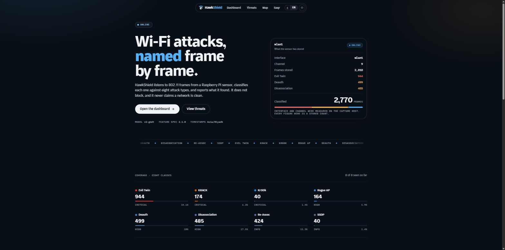

</div>

---

## What it sees

Nine classes, one of which is `Normal`. Per-class F1 below is the **shipping** model (LightGBM) on
5,943,908 held-out frames, as measured by `ml/evaluate.py`. Nothing here is rounded up.

| Class | What it is | F1 | Held-out support |
|---|---|---:|---:|
| `Normal` | everything the sensor decides is not an attack | 0.9992 | 4,449,777 |
| `Deauth` | forged deauthentication frames | 0.9863 | 9,851 |
| `Disas` | forged disassociation frames | 0.9578 | 18,820 |
| `(Re)Assoc` | (re)association flooding | 0.9975 | 1,401 |
| `RogueAP` | an access point that should not be there | 1.0000 | 331 |
| `Krack` | key-reinstallation attack | 0.9999 | 16,009 |
| `Kr00k` | all-zero TK, CVE-2019-15126 | 0.9875 | 47,332 |
| `Evil_Twin` | a clone of a legitimate AP | 0.9900 | 26,218 |
| `SSDP` | SSDP/UPnP amplification | 0.9977 | 1,374,169 |
| | **macro-F1** | **0.9907** | **5,943,908** |

A frame is stored only if it clears **both** gates: `p1 = 1 − P(Normal) ≥ 0.40`
(`STAGE1_THRESHOLD`) and then `p2 = P(argmax attack class) ≥ 0.80` (`STAGE2_THRESHOLD`).
Normal traffic is classified and dropped — it is never written.

---

## See it

<table>
<tr>
<td width="50%">

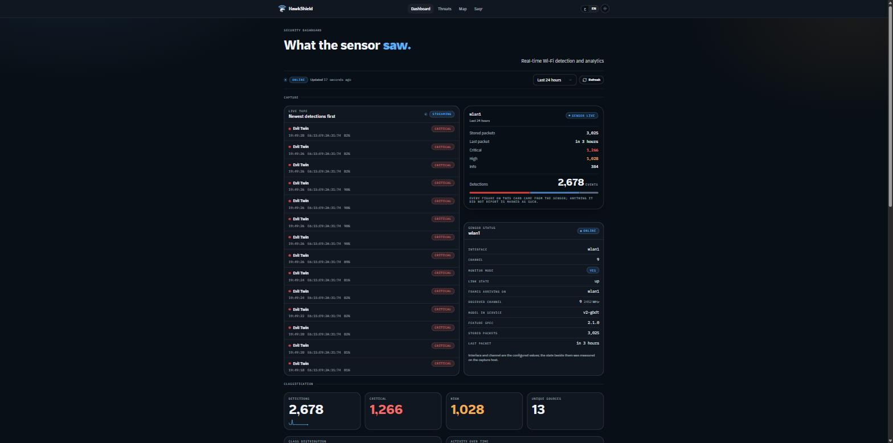
**`/dashboard`** — live tape over SSE, sensor status, and the model actually in service.

</td>
<td width="50%">

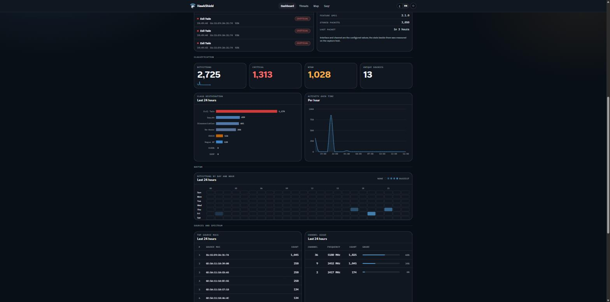
Class distribution, activity per hour, a day×hour heatmap, top source MACs, channel usage.

</td>
</tr>
<tr>
<td width="50%">

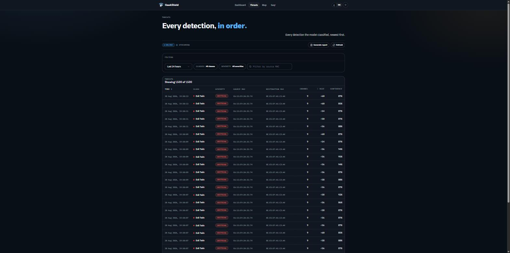
**`/threats`** — every detection the model classified, newest first, filterable by window, class, severity and source MAC.

</td>
<td width="50%">

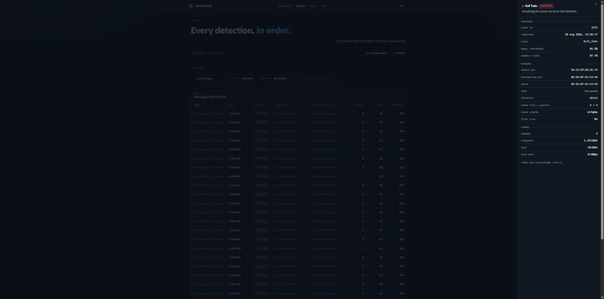
One row opened: confidence, anomaly score, addresses, frame type/subtype, channel, RSSI, data rate.

</td>
</tr>
<tr>
<td width="50%">

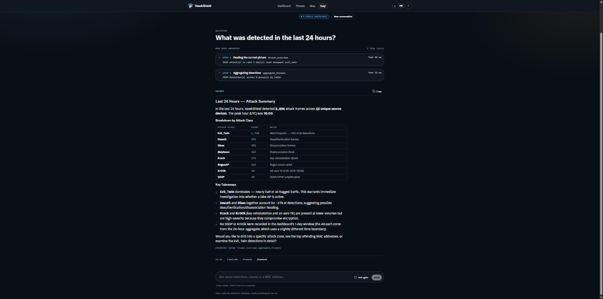
**`/saqr`** — the analyst. Every answer shows the tools it called, their arguments, and how long each took.

</td>
<td width="50%">

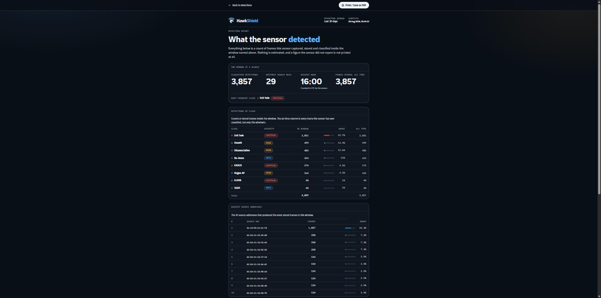
**`/report`** — a print-first detection report; the same figures export to a one-page A4 PDF.

</td>
</tr>
<tr>
<td width="50%">

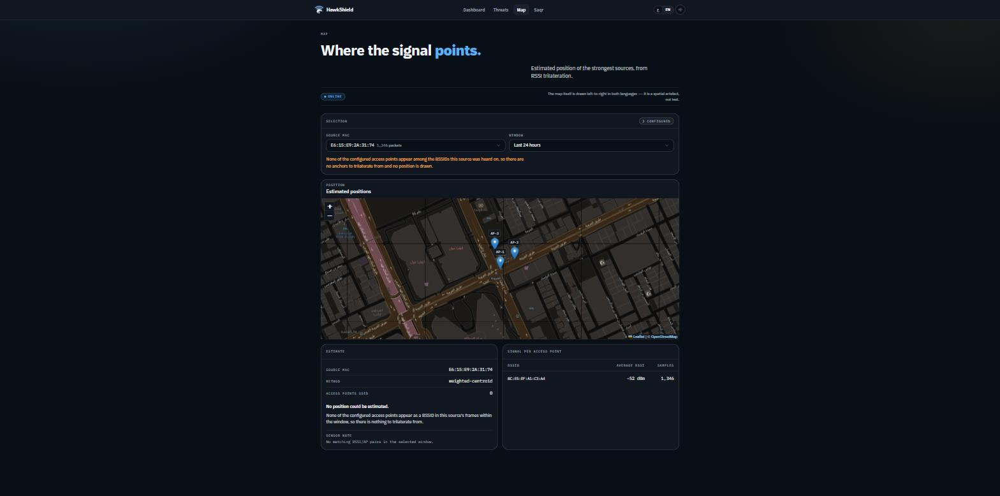
**`/map`** — RSSI-weighted trilateration. Here it refuses: no configured AP appears among the BSSIDs this source was heard on, so **it draws nothing and says why** rather than inventing a pin.

</td>
<td width="50%">

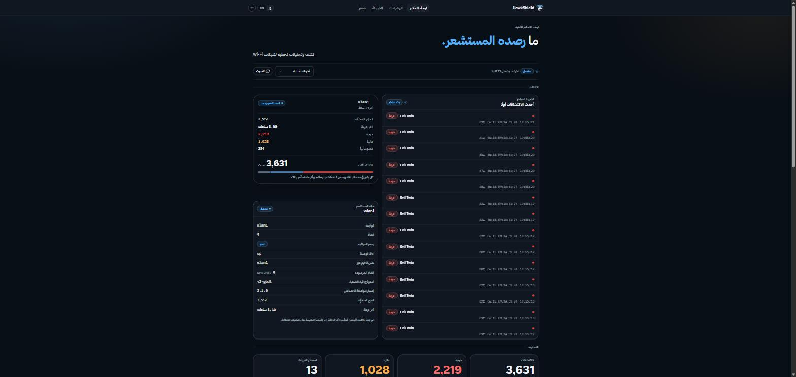
The whole console mirrors to RTL Arabic — layout, numerals, and the map's own left-to-right exception.

</td>
</tr>
</table>

<div align="center">

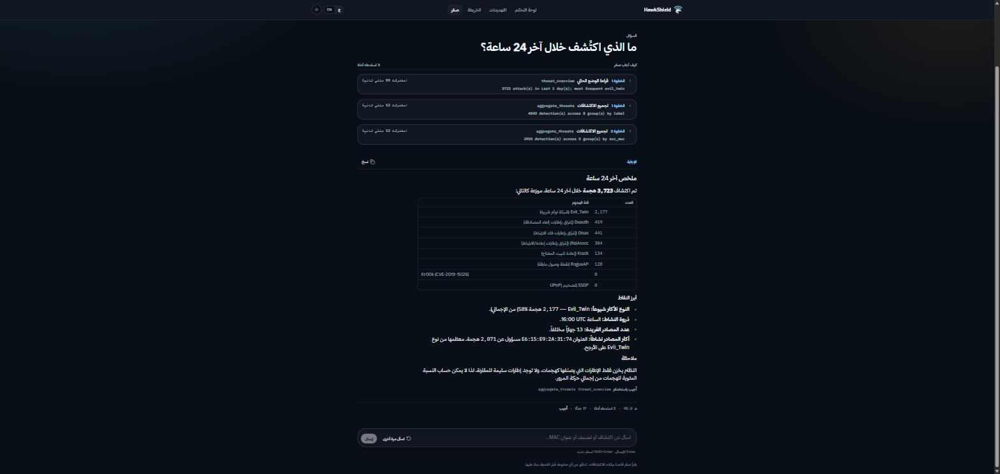

*Saqr answering in Arabic against the same database — and volunteering the caveat that only
attack frames are stored, so a hit rate against total traffic cannot be computed.*

</div>

---

## Quickstart

```bash
python run.py
```

That is the whole thing. It works out where it is, checks what can go wrong before it goes wrong,
and starts what that machine needs:

| Detected | What starts | Database |
|---|---|---|
| **Raspberry Pi** — `/proc/device-tree/model`, then Linux + `aarch64`/`armv7l` | detector (live capture) **+** API **+** dashboard | PostgreSQL, **required** — it refuses to start without one |
| **Anything else** — laptop | API **+** dashboard over whatever is already stored | PostgreSQL if configured, otherwise a SQLite file it creates for you |

### No radio, no database, no config

```bash
python run.py --demo
```

`--demo` replays one of the bundled `.pcapng` captures through the **real** detection pipeline and
stores what the model flags, so the dashboard, the reports and the assistant all have genuine data.

```
  HawkShield
  Windows AMD64
  detected: LAPTOP

-- checks ------------------------------------------------------------
  OK    .env found
  WARN  no usable DATABASE_URL -- using a local SQLite file for this session
        sqlite:///D:/HawkShield/hawkshield.db
  OK    model bundles present
  OK    dashboard build found (frontend/out)
  OK    database reachable, schema ready

-- demo data ---------------------------------------------------------
        replaying assoc_flood_raw_decrypted.pcapng (1500 frames) into the database...
        persisted (p2>=0.80): 592 (39.47%)

-- starting ----------------------------------------------------------
        detector off -- dashboard reads existing data only

  Dashboard   http://localhost:8000
  API docs    http://localhost:8000/docs
  Health      http://localhost:8000/health

  Ctrl-C to stop
```

<details>
<summary><b>Preflight steps and every flag</b></summary>

<br/>

Before starting anything, `run.py`:

1. Creates `.env` from `.env.example` if missing.
2. Picks a database. If `DATABASE_URL` is unset or still says `CHANGE_ME`: **laptop** falls back to
   a SQLite file and says so; **Pi** exits 2 rather than quietly writing a sensor's attack log
   somewhere nothing backs up.
3. Checks `models/` holds a usable artefact — **any** of `hawkshield_v2_gbdt.txt` + meta,
   `hawkshield_v2.onnx` + meta, or the two v1 `.joblib` bundles.
4. Checks for a dashboard build at `frontend/out` — warns, does not fail.
5. Runs the schema migration (`python -m backend.scripts.init_db`).
6. Checks the port is free, suggests the next one if not.
7. On the Pi, checks for root — without it the detector cannot open a raw socket, so it falls back
   to dashboard-only and prints the `sudo` hint.

| Flag | Default | Effect |
|---|---|---|
| `--mode auto\|pi\|laptop` | `auto` | override the machine detection |
| `--host` / `--port` | `0.0.0.0` / `8000` | bind somewhere else |
| `--demo` | off | replay a capture into the database before starting |
| `--demo-capture PATH` | `data/samples/assoc_flood_raw_decrypted.pcapng` | which capture |
| `--demo-frames N` | `4000` | how many frames |
| `--detector` / `--no-detector` | on for Pi, off for laptop | force live capture |
| `--iface` / `--channel` | from `.env` | passed to the detector CLI |
| `--reload` | off | uvicorn auto-reload |

Use the project's own interpreter (`.venv/bin/python`, or `.venv/Scripts/python.exe` on Windows)
and run **from the repo root** — `backend` is a package and the module paths assume it.

</details>

---

## How it works

### The whole system

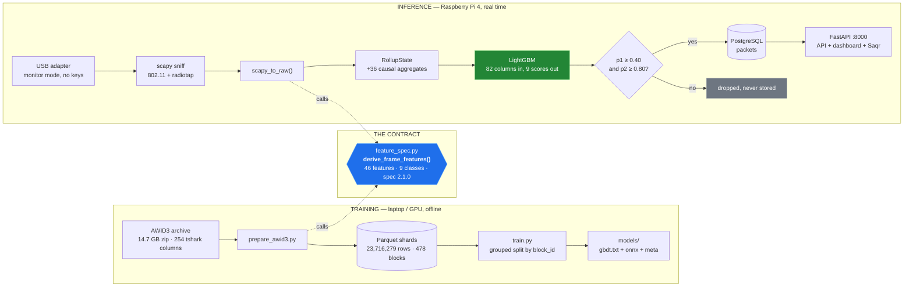

**Training and inference call the same function to turn a frame into features.** That is the single
most important property of the design, and it is the direct answer to how v1 failed. If a feature
cannot be produced on a monitor-mode Pi, it does not enter the spec — and `EXCLUDED_COLUMNS` names
every banned field, in code, with the reason it is banned. The one that broke v1 has its own test:
`test_frame_time_delta_is_relative_only` asserts no absolute session time can reach the vector.

The runtime backs this with a refusal: `V2Pipeline` will not load an artefact whose spec version,
class list, feature list or **feature order** disagrees with the running code. It caught a stale
artefact on its first run.

### One frame in, 82 columns out

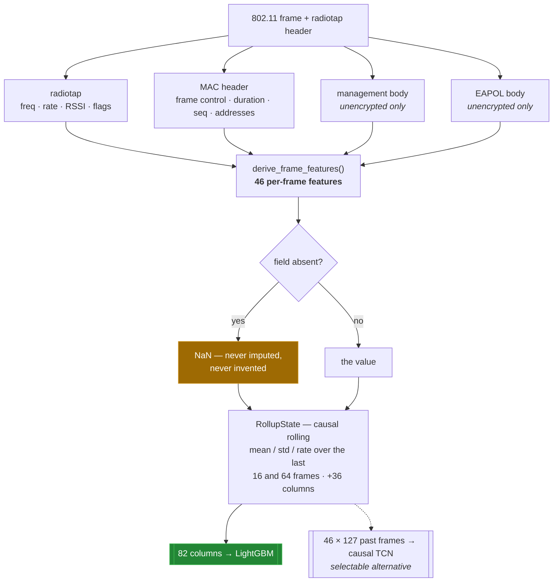

The **contract is 46 per-frame features**. The shipping booster consumes **82**: those 46 plus 36
causal rolling aggregates over windows `[16, 64]`, built one frame at a time by `RollupState` so
the live path reproduces exactly what training computed — a property asserted by
`test_rollup_spec_matches_the_training_module` and
`test_streaming_rollups_reproduce_the_training_matrix`, with `test_rollups_are_causal` proving the
window never reaches forward.

A field the frame does not carry becomes **NaN**, and stays NaN. It is never mean-imputed. For the
TCN, NaN reaches the model as a learned per-feature sentinel plus a companion mask channel.

### Why the split looks the way it does

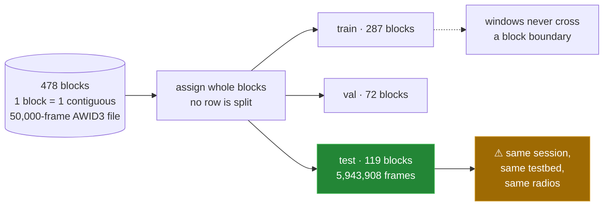

Weaker than leave-one-capture-out, and deliberately so: `frame.number` runs continuously across an
attack's chunk files, so holding out a capture deletes the class outright. The caveat is stated
wherever the numbers are, including here.

The TCN, kept selectable, reaches the same context a different way: **six causal blocks, kernel 3,
dilations 1 · 2 · 4 · 8 · 16 · 32**, giving a receptive field of `1 + 2 × (1+2+4+8+16+32)` =
**127 past frames** without ever reading forward. It is not given the rolling columns at all — it
builds its own temporal view.

---

## Results

Trained on AWID3 (University of the Aegean), evaluated on 119 held-out blocks — 5,943,908 frames
across all nine classes.

| Model | Held-out macro-F1 | Artefact | Status |
|---|---:|---|---|
| **LightGBM** — 441 trees (49 × 9 classes), 63 leaves | **0.9907** | `hawkshield_v2_gbdt.txt`, 3.0 MB | **ships** — `MODEL_VERSION=auto` resolves here |
| Causal dilated TCN — 80,527 parameters | 0.9856 | `hawkshield_v2.onnx`, 348 KB | selectable (`v2-tcn`) |
| v1 two-stage `.joblib` | — see the post-mortem | `stage{1,2}_*.joblib` | last-resort fallback (`v1`) |

**The tree won a fair head-to-head on the identical grouped split.** That is a legitimate result,
not a bug to tune away — it is smaller, faster and easier to reason about on a Pi.

### The leakage probe

v1 scored ~99 % under a random shuffle and detected nothing real. The test that exposes that class
of failure: delete the model's single most important feature and re-measure. A healthy detector
degrades gracefully; a leaky one falls off a cliff.

| Ablated feature | Model | macro-F1 | Δ |
|---|---|---:|---:|
| `roll64.frame.dt_log.mean` | LightGBM, **retrained** without it | 0.9899 | **−0.0007** |
| `roll64.frame.dt_log.mean` | LightGBM, score-only (set to NaN) | 0.9876 | −0.0030 |
| `addr.ta_eq_sa` | TCN, score-only | 0.8912 | −0.0944 |

The retrained row is the evidence; the score-only rows show how brittle the *deployed* weights are
to that field going missing on a real capture. Score-only ablation sets the feature to **NaN**, not
zero — zeroing post-normalises to the training mean, which is the exact silent imputation that
broke v1. **This ablation is a standing part of `ml/evaluate.py`**, not a one-off investigation.

### Cost of inference

From the export's own measurements, in [`models/hawkshield_v2_meta.json`](models/hawkshield_v2_meta.json):

| | fp32 | int8 |
|---|---:|---:|
| ONNX size | 347.8 KB | 133.5 KB |
| Streaming latency, per window | **0.394 ms** | 1.648 ms |
| Argmax agreement with PyTorch | 1.0 | 1.0 |
| Max absolute logit difference | 5.7 × 10⁻⁶ | 0.465 |

Measured on a dev CPU with 4 ONNX Runtime intra-op threads; expect 4–8× on a Raspberry Pi.
**Do not ship the int8 variant** — 2.6× smaller and ~4× *slower*, because onnxruntime has no fast
int8 Conv1d kernel at these shapes.

<details>
<summary><b>The v1 post-mortem — the most instructive thing in this repository</b></summary>

<br/>

Two failures produced a model that scored ~99 % on a random shuffle and detected nothing real.
Every part of v2's design is a direct response to one of them.

**1. Training and inference derived features in different code.** The bundles were trained on
tshark columns; the detector runs scapy. **16 of the 29 numeric features could not be produced live
at all.** They arrived NULL on every frame and were mean-imputed by the bundle's own `SimpleImputer`
to training medians — and the model keyed on those constants. Nothing in the system reported it.

**2. `frame.time_relative` was leakage.** Seconds since capture start carried **41.9 % of stage-1's
split gain** while encoding nothing but *which capture session a row came from*. It also drifts: a
detector up for a day feeds values near 86,400 where the model saw ~583, and restarting resets it.
`radiotap.channel.freq` carried another ~8.9 % and encoded the band.

Ablation on a 20,000-frame capture that is ~97 % genuine deauthentication frames:

| Stage-1 input | Frames flagged |
|---|---:|
| all features correctly populated | 82 / 20,000 (**0.41 %**) |
| `frame.time_relative` forced null → imputed to 583 s | 20,000 (**100 %**) |
| `radiotap.channel.freq` forced null → imputed to 5180 MHz | 0 (**0 %**) |

Reproduce any row with the shipped tooling:

```bash
python -m backend.scripts.replay_pcap data/samples/deauth_raw_decrypted.pcapng \
    --model-version v1 --dry-run --null-feature frame.time_relative
```

A model whose output swings between 0 % and 100 % on the presence of one bookkeeping column is not
detecting anything.

| v1 failure | v2 response |
|---|---|
| two feature implementations that could drift apart | **one** `derive_frame_features()`, called by both `ml/prepare_awid3.py` and `backend/detector/features.py` |
| 16 of 29 features permanently NULL live | a feature that cannot be produced live may not enter the spec |
| missing values mean-imputed to a training constant | NaN stays NaN; a learned sentinel plus a mask channel |
| session- and band-identity features in the model | `EXCLUDED_COLUMNS` bans them by name, in code, with the reason; `test_frame_time_delta_is_relative_only` holds the line on the worst one |
| random row shuffle across the split | whole 50,000-frame `block_id` groups held out |
| feature space could silently disagree with the artefact | `V2Pipeline` refuses to load on any spec / class / feature / order mismatch |
| six classes, no way to say "normal" | nine classes, `Normal` among them |
| nothing would have noticed any of this | the leakage ablation is a standing part of `ml/evaluate.py` |

**Two v1 bugs that may have misled you.** `wlan.duration` was byte-swapped — scapy declares the
802.11 Duration/ID field big-endian, the header is little-endian, so a real 314 µs duration was fed
to the model and written to `packets.wlan_duration` as **14,849**, on every frame since day one.
And the dashboard rendered every `(Re)Assoc` row as `SSDP`: an alias table round-tripped a key
through its display string and fell back to the first allowed type. **Any SSDP figure read off the
attacks page before that fix was inflated**; the stored rows were always correct.

Both bugs are fixed, and both are named here rather than quietly dropped, because a reader who saw
the old dashboard deserves to know which figures were wrong.

</details>

---

## Saqr, the analyst

Ask the sensor a question in English or Arabic. Saqr answers by calling tools that run the same
Python the dashboard endpoints run, so its numbers and the dashboard's cannot disagree — and it
shows every step it took.

**Twelve tools live in the registry; seven are published by default.** The mutating and admin ones
(`run_simulation`, `purge_simulated_detections`, `delete_detections`, `export_report`,
`get_runtime_config`) are never shown at all unless `SAQR_ADMIN_TOKEN` is configured — *a model
cannot call a tool it was never shown*, which is a stronger statement than "it was told not to".

The destructive ones then go through a **two-phase confirmation** that the model cannot satisfy on
its own:

- the tool never acts on its first call — it *proposes*, and the server mints a token;
- the token travels **outside the conversation**, back to the client, and returns in an
  `X-HawkShield-Confirm` header, resolved once before the model runs;
- tool argument models are `extra="forbid"`, so a model that tries to pass a token as an argument
  is rejected by pydantic before any code runs, and the token is stripped from the copy the model
  reads;
- `fingerprint()` binds the token to the exact normalised arguments — a token minted for "delete
  Deauth rows from the last 10 minutes" cannot authorise "delete everything".

It runs over [OpenRouter](https://openrouter.ai). With `OPENROUTER_API_KEY` empty, the API starts
normally and only the assistant returns 503; no other endpoint or page is affected.

| `GEN_MODEL` | Why | ~$ / M tokens (in / out) |
|---|---|---|
| **`deepseek/deepseek-v4-flash`** *(default)* | strong SQL, strict JSON, 1M context | 0.08 / 0.16 |
| `z-ai/glm-5.3-flash` | close second, different failure modes | 0.075 / 0.25 |
| `qwen/qwen3.7-flash` | cheapest | 0.03 / 0.13 |
| `qwen/qwen3-235b-a22b-2507` | largest, slowest; only if the small ones misroute | 0.09 / 0.55 |

```bash
python backend/scripts/check_saqr.py     # key → model exists → DOCS answer → valid SQL → SQL runs
```

Exit 0 means the assistant will work. `--skip-db` checks the model only.

> [!NOTE]
> **This has nothing to do with the detection model.** Saqr is a hosted LLM that reads the `packets`
> table. The *detector* is the artefact in `models/`, and it runs entirely offline on every frame.
> Changing `GEN_MODEL` does not make a label more trustworthy — a better analyst reads the same rows
> more fluently.

---

## Endpoints

One process, one port. API routes register first; the static export mounts last at `/`, so the
catch-all can never shadow an endpoint. Interactive request/response schemas for every route are
served live at `/docs`.

| Method | Path | Purpose |
|---|---|---|
| GET | `/health` | DB reachability, packet count, **`model_version` / `spec_version` / `artefact_spec_version`**, capture state |
| GET | `/attacks` | raw `packets` rows, newest first |
| GET | `/attacks/analysis` | count per label — always all eight attack keys, zero-filled |
| GET | `/attacks/series` | detections over time |
| GET | `/packets/count` | `{"count": int}` |
| GET | `/top-offenders` | source MACs by volume |
| GET | `/channel-usage` | frame counts per radiotap frequency |
| GET | `/heatmap-attack` | 7 days × 24 hours intensity grid |
| GET | `/map/ap-locations` | configured AP inventory |
| GET | `/map/source-rssi` | average RSSI per BSSID for one source MAC |
| POST | `/map/estimate-origin` | RSSI-weighted centroid of the supplied APs |
| GET | `/reports/summary` | totals by type plus headline figures |
| POST | `/reports/export` | one-page A4 PDF (`application/pdf`) |
| POST | `/agent/ask` | Saqr. `POST /ask` is the legacy shim for the same thing |
| GET | `/agent/tools` | the tool surface this host publishes |
| POST | `/simulate` | replay held-out AWID3 rows through the **real** model and persist genuine detections |
| GET | `/stream` | Server-Sent Events, one event per new detection row, `?since_id=N` to resume |
| GET | `/` `/dashboard/` `/threats/` `/map/` `/saqr/` `/attacks/` `/report/` `/rag/` `/admin/` | the static dashboard |

**Removed on purpose:** `POST /detector/start` and `POST /reports/email`. The detector is a systemd
service, not an HTTP-controlled subprocess, and the email endpoint was a stub that never sent
anything.

---

## Running it for real

> On the deployed Pi the services start at boot — there is nothing to launch by
> hand. [`RUNBOOK.md`](RUNBOOK.md) is the plain-language on-site guide: the one
> `hawkshield` command, pointing it at the right network, and showing an attack.

<details>
<summary><b>Raspberry Pi — the hardware, and the systemd install</b></summary>

<br/>

| Item | Requirement |
|---|---|
| Board | Raspberry Pi 4 (4 GB+), Raspberry Pi OS **Bookworm**, Python 3.11 |
| Storage | microSD ≥ 16 GB, or USB SSD |
| **Capture radio** | **a USB Wi-Fi adapter that supports monitor mode** |
| Uplink | the Pi's built-in `wlan0` or Ethernet, for management/SSH |

> [!WARNING]
> **The Pi 4's built-in `wlan0` generally cannot do monitor mode.** Its Broadcom/Cypress firmware
> either refuses the mode switch or silently captures nothing. You need a second, external adapter.
> Known-good chipsets: **Atheros AR9271**, **Ralink RT3070 / RT5372**, **MediaTek MT7601U**,
> **Realtek RTL8812AU** with the aircrack-ng driver. It normally enumerates as `wlan1` — confirm
> with `ip -br link`.

The adapter's channel, `CAPTURE_CHANNEL` in `.env`, and the argument given to `monitor_mode.sh`
must all agree.

```bash
git clone <your-repo-url> ~/HawkShield && cd ~/HawkShield

# The FIRST run stops on purpose (exit 3) after copying .env.example -> .env:
# the installer will not invent a database password.
sudo ./deploy/install_pi.sh
nano .env                                  # set DATABASE_URL, CAPTURE_IFACE, CAPTURE_CHANNEL
sudo ./deploy/install_pi.sh                # apt deps, PostgreSQL, venv, schema, systemd units

sudo ./deploy/monitor_mode.sh wlan1 6      # adapter into monitor mode on your channel
sudo systemctl start hawkshield-api hawkshield-detector
curl -s http://localhost:8000/health
```

The Pi expects PostgreSQL. There is no SQLite fallback there — `run.py` exits 2 rather than quietly
writing a sensor's attack log to a file that nothing backs up.

**`frontend/out/` is git-ignored**, so a fresh clone has no dashboard until you build it — and the
build **needs network access** (`app/layout.tsx` imports `Inter` from `next/font/google`, fetched at
build time). Build on a networked machine and copy the directory across:

```bash
cd frontend && npm ci && npm run build     # -> frontend/out/
```

Day to day there is nothing to start — both units are enabled at boot, so powering the Pi on brings
up capture, the model and the dashboard. `deploy/hawkshield.sh`, installed as `hawkshield`, covers
what actually changes when the Pi leaves the bench:

```bash
hawkshield                 # status, capture health, network layout, and the URL to open
hawkshield channel auto    # follow whatever channel wlan0 is on
hawkshield channel 6       # or pin one explicitly
hawkshield wifi SSID       # join a network on wlan0 (prompts for the password)
hawkshield hotspot         # serve a network from wlan0 when the venue has none
hawkshield reset           # re-bind the USB adapter when the radio goes silent
hawkshield restart         # restart both services
hawkshield logs            # follow the detector
```

`hawkshield reset` earns its place: some USB adapters stop delivering frames while still reporting
`up` at the kernel level, and a rebind is the only thing that brings them back.

</details>

<details>
<summary><b>Laptop / development</b></summary>

<br/>

Nothing about HawkShield requires a Pi except the radio.

```bash
python -m venv .venv
.venv/bin/pip install -r backend/requirements-dev.txt
.venv/bin/python run.py --demo
```

By hand, which is what `run.py` runs underneath:

```bash
cp .env.example .env
.venv/bin/python -m backend.scripts.init_db
.venv/bin/uvicorn backend.app.main:app --reload --port 8000
```

| Frontend mode | Command | `NEXT_PUBLIC_API_BASE` |
|---|---|---|
| static export served by FastAPI (production shape) | `cd frontend && npm run build` | empty — same origin |
| `next dev` hot reload against a running API | `cd frontend && npm run dev` | `http://localhost:8000` or `http://<pi-ip>:8000` |

`NEXT_PUBLIC_*` values are inlined at build time — changing one requires a rebuild. It is read in
exactly one place, `frontend/lib/api.ts`, whose `apiFetchSafe()` never throws: on any error it
returns the caller's fallback, so a page renders an empty state instead of crashing when the
backend is down.

</details>

<details>
<summary><b>Offline replay, live simulation, and the over-the-air test</b></summary>

<br/>

**Replay.** `data/samples/` holds six 20,000-frame `.pcapng` captures. `replay_pcap.py` pushes them
through the *same* extractor and pipeline the live detector uses, so what it prints is what the Pi
would have done with those frames.

```bash
python -m backend.scripts.replay_pcap data/samples/deauth_raw_decrypted.pcapng
python -m backend.scripts.replay_pcap data/samples/*.pcapng --limit 5000 --json
python -m backend.scripts.replay_pcap data/samples/beacon_raw_decrypted.pcapng --to-db
```

The report prints frames read, capture span, the gate hit rate, the label distribution, and
per-feature non-null coverage — the fastest way to tell whether extraction is doing its job on a new
capture. `--null-feature NAME` (repeatable) is the leakage ablation; `--model-version` chooses the
generation.

**Simulation.** `POST /simulate` replays `data/sim/awid3_sim_corpus.parquet` — contiguous held-out
AWID3 segments, 306 KB, committed, all eight classes — through the real `build_pipeline` and writes
what the model flags via the same `PacketSink` the detector uses. The response reports what the
model *did*, not what was asked. Gated by `ALLOW_SIMULATION` (403 when off), capped by
`SIM_MAX_COUNT` (default 500), rate-limited (429). Every simulated row is tagged `raw.sim = true`.

**Watch it from a terminal.**

```bash
python -m backend.detector.cli --self-test                    # exit 0 = model loads and predicts here
python -m backend.scripts.live_monitor --follow               # coloured tail of detections as they land
python -m backend.scripts.live_monitor --follow --sim-only    # only /simulate rows
```

**Failover.** When the API is unreachable or `/health` reports `database: false`, the dashboard
shows a "Reconnecting…" chip, keeps the last good data on screen with an "Updated Ns ago" stamp,
and keeps the Simulate control usable. Composure, never fabricated numbers.

**The real proof — over the air.** On the Pi, `attack/attack.sh` is the one-command operator
version: it targets the access point `wlan0` is already associated with, on the assumption that it
is yours. Underneath it, `tools/inject_attack.py` transmits real 802.11 frames from a
second monitor-mode adapter against your **own** testbed and grades what the Pi detected
(PASS/PARTIAL/FAIL). It is the one test that exercises antenna → capture → model → database end to
end.

> [!CAUTION]
> **Transmitting deauth/disassoc frames against networks you do not own is illegal in most
> jurisdictions — this is for your own testbed only.** The tool refuses without both
> `--i-own-this-network` and an explicit `--target-bssid`, and caps count and rate in code. A
> PARTIAL verdict (attack seen, different label) is the expected shape of the AWID3
> cross-deployment gap, not a bug.

</details>

---

## Training the model

Runs on a laptop or workstation with a GPU. **Never on the Pi** — it reads a 14.7 GB archive, wants
PyTorch and ~4.5 GB of RAM, and the Pi's job is to load a finished model, not to build one.

```powershell
.\ml\run_training.ps1 -Fresh      # Windows
```
```bash
./ml/run_training.sh --fresh      # Git Bash / WSL
```

One command: dependency check → preprocess AWID3 → train → evaluate → export. Each stage is echoed
and a failure stops the run with the exit code and the stage name. **~50–90 minutes** end to end on
an RTX 4070 SUPER with 16 cores; 4–6 hours CPU-only.

Useful variants: `--model gbdt` (tree only, no GPU), `--max-rows 2000000 --epochs 3` (fast sanity
pass), `--device cpu`, `--skip-export`. **PyTorch is not installed for you** — it is a 2.5 GB wheel
and the CUDA build is your choice.

The run produces `models/hawkshield_v2_gbdt.txt`, `hawkshield_v2.onnx` and
`hawkshield_v2_meta.json` — copy them to the Pi and restart the detector — plus a training report
and an evaluation report under `ml/reports/`. **Those two reports are where every accuracy number
in this README comes from**, and they are rewritten from scratch on every run, so a stale figure
cannot survive a retrain.

---

## Testing

```bash
python -m pytest backend/tests        # from the repo root
```

**740 tests, 0 failures, 0 errors, 0 skipped, 85 s.**

| Suite | Tests | Covers |
|---|---:|---|
| `test_pipeline_v2.py` | 86 | spec-mismatch refusal, streaming/batching equivalence, the GBDT rolling-aggregate reproduction, verdict mapping, threading |
| `test_agent_guardrails.py` | 77 | Saqr's guards: tool gating, admin visibility, the two-phase confirmation protocol |
| `test_agent_tools.py` | 75 | all twelve tools against a temporary database |
| `test_agent_sqlguard.py` | 70 | `SELECT`-only enforcement, row limiting, dialect handling, injection paths |
| `test_analytics_params.py` | 58 | every analytics endpoint's parameter surface |
| `test_features_v2.py` | 57 | the 46-feature contract: derivation from real frames, the multi-value cell parser, NaN conventions, no banned field reachable |
| `test_agent_knowledge.py` | 52 | the knowledge base and class explanations |
| `test_agent_stream.py` | 51 | SSE event ordering, redaction of confirm tokens, cancellation |
| `test_ask_shim_contract.py` | 47 | the legacy `POST /ask` shim against the agent |
| `test_agent_loop.py` | 36 | the tool-calling loop, step limits, error paths |
| `test_inject_attack.py` | 25 | the over-the-air tool: the safety gate, count/rate caps, frame building — no radio or root needed |
| `test_features.py` | 22 | v1 feature extraction from real frames |
| `test_api.py` / `test_agent_prompt.py` | 16 / 16 | every endpoint against a temporary database; prompt assembly |
| `test_attack_sim.py` / `test_runtime_config.py` | 13 / 13 | the frame factory and corpus loader; blank `.env` fallbacks, SQL dialect follows `DATABASE_URL` |
| `test_pipeline_pcap.py` / `test_simulate.py` | 9 / 9 | v1 bundle transform order, replay over the samples; `/simulate` end to end |
| `test_admin_purge.py` | 8 | the destructive admin path and its confirmation |

The one worth singling out is the **causality probe**: it perturbs every *future* frame and asserts
the past outputs are **bit-identical**. A model that can see forward fails the suite rather than
quietly inflating a score. At export time the measured past-side delta is `0.0`; the future-side
delta is `1.627`, which proves the probe bites.

```bash
python -m backend.scripts.verify_models     # v1 bundle digests, feature counts, class map
python ml/model.py                          # the causality probe standalone (needs torch)
python backend/scripts/check_saqr.py        # the assistant end to end (needs a key + network)
python backend/scripts/check_frontend.py    # the shipped frontend/out build against this backend
cd frontend && npx tsc --noEmit             # the static export builds with zero TypeScript errors
```

---

## Repository layout

```
HawkShield/
├── backend/
│   ├── app/                    FastAPI only — must not import backend.detector.*
│   │   ├── config.py             pydantic-settings; every component reads this object
│   │   ├── models.py             Packet / Document ORM — the only schema declaration
│   │   ├── main.py               app factory: routers first, static mount last
│   │   ├── routers/              health · attacks · reports · maps · ask · simulate · stream · admin
│   │   └── agent/                Saqr: tools, loop, guards, sqlguard, two-phase confirm, SSE events
│   ├── detector/               capture + inference — must not import backend.app.routers.*
│   │   ├── feature_spec.py       THE CONTRACT: 46 features, 9 classes, derive_frame_features()
│   │   ├── features.py           scapy_to_raw() + packet_to_features_v2()
│   │   ├── pipeline.py           V2Pipeline, RollupState, the v1 two-stage path, Verdict
│   │   ├── capture.py            monitor mode, sniff loop, heartbeat, ENETDOWN recovery
│   │   └── sink.py               PacketSink — batched writes, 20 rows / 2.0 s
│   ├── scripts/                init_db · verify_models · replay_pcap · live_monitor · check_saqr
│   └── tests/                  740 tests
├── ml/                         training — laptop/GPU, never the Pi
│   ├── prepare_awid3.py          streams the AWID3 zip → Parquet, via feature_spec
│   ├── windows.py                grouped split, causal windowing, the rollup spec
│   ├── model.py                  the causal dilated TCN + assert_causal()
│   ├── train.py · evaluate.py    both models on the identical split; the standing leakage ablation
│   └── reports/                  train_report.md, eval_report.md — where the numbers live
├── frontend/                   Next.js 15 / React 19 / Tailwind v4 → static export in out/
├── models/                     gbdt.txt · onnx (+int8) · meta.json · v1 bundles · README.md
├── data/                       samples/*.pcapng (6) · sim/awid3_sim_corpus.parquet
├── deploy/                     install_pi.sh · monitor_mode.sh · postgres_setup.sql · 2 × .service
├── attack/                     attack.sh — the one-command over-the-air demo
├── tools/                      inject_attack.py — the injector it drives
├── docs/                       CONTRACT.md · model-pipeline.md · architecture.md · deployment-pi.md
│                               api.md · models.md · demo.md
├── run.py                      the launcher
└── .env.example                every variable, documented
```

`_work/` (git-ignored) holds training intermediates: `_work/awid3_v2/` for the Parquet shards,
`_work/models_v2/` for checkpoints and `split.json`.

---

## Roadmap — not built

None of the following exists in this codebase. They are future work, not features.

- [ ] **Prevention (the "P" in IPS)** — deauthenticating or blocking a malicious source, MAC
      denylisting, WLAN-controller or RADIUS integration. HawkShield only observes.
- [ ] **Alerting** — email, webhooks, Slack, syslog. There is no notification path of any kind.
- [ ] **Evaluation beyond one testbed** — AWID3 recorded each attack once, so the split measures
      generalisation across time within a single recording, not across deployments. This is the
      highest-value item on the list.
- [ ] **A `verify_models` v2 mode** — the script inspects the v1 joblib bundles only; the v2 check
      today is `V2Pipeline`'s own load-time validation, surfaced by `/health`.
- [ ] **Channel hopping** — the adapter is pinned to one channel for the life of the process.
- [ ] **Normal-traffic sampling** — only attacks are persisted, so the table cannot be used to
      estimate a false-positive rate after the fact.
- [ ] **Multi-sensor aggregation**, mobile dashboard, cloud sync, SIEM export.

---

## Credits

Built as a capstone project by
[**Mohammed Alshabib**](https://github.com/MAlshabib),
[**Yasser Albogami**](https://github.com/YasserAlbogami),
**Haya Alkhthran**,
[**Ghala Alotaibi**](https://github.com/ghalaotb1) and
[**Lena Aldokhayel**](https://github.com/Lena-dk).
See [`CONTRIBUTORS.md`](CONTRIBUTORS.md).

Built on FastAPI, SQLAlchemy, PyTorch, ONNX Runtime, LightGBM, scikit-learn, scapy, ReportLab,
Next.js, React, Tailwind CSS, Recharts and Leaflet. The model is trained on **AWID3**
(University of the Aegean).

## Licence

Proprietary. Copyright (c) 2026 Mohammed, Yasser, Haya, Ghala, Lena. All rights reserved.
See [`LICENSE`](LICENSE).

> [!CAUTION]
> Capturing 802.11 traffic you are not authorised to monitor is illegal in many jurisdictions. Run
> HawkShield only against networks you own or have written permission to test.
