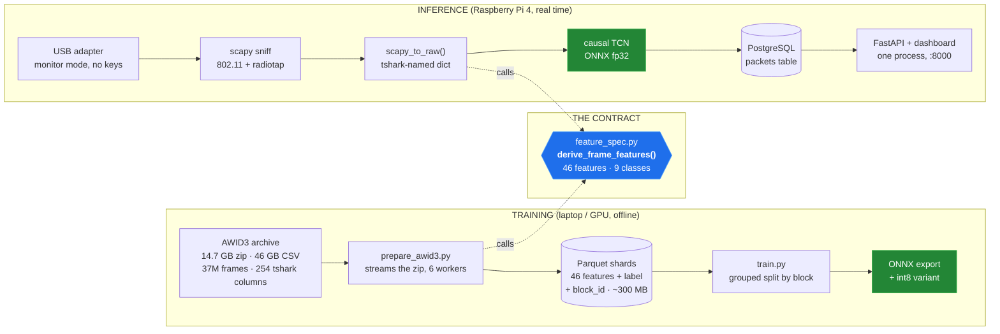
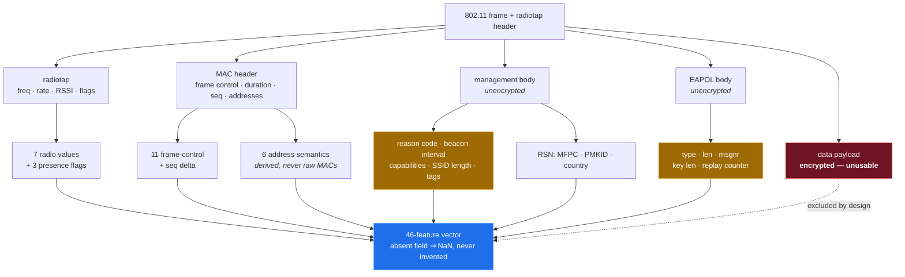
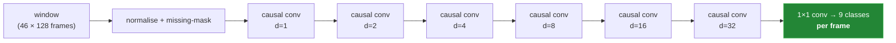
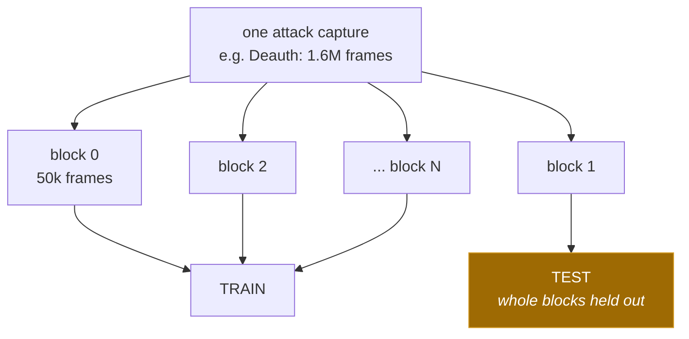

# HawkShield v2 — model pipeline

How a Wi-Fi frame becomes a labelled attack, from antenna to dashboard, and how the
same code path is used to train the model. Diagrams render natively on GitHub.

---

## 1. The whole system



**The single most important property of this design**: training and inference call the
*same function* to turn a frame into features. In v1 they were two separate
implementations, 16 of 29 features were silently NULL in the field, and the model
keyed on the mean-imputed constants that replaced them. That failure is now
structurally impossible — if a feature cannot be produced live, it is not in the spec.

---

## 2. Feature derivation — one frame in, 46 numbers out



The two amber boxes are what v1 never looked at, and they carry most of the signal:

| feature | Deauth | Disas | Kr00k | RogueAP | Normal |
|---|---:|---:|---:|---:|---:|
| `mgmt.has_reason` | **100%** | **100%** | **100%** | 0% | 0.3% |
| `addr.da_broadcast` | 0% | 0% | 0% | **100%** | 1.0% |
| mean `frame.len` | 86 | 86 | 86 | 263 | 454 |

Measured on AWID3, 2.4M frames. Reason code 7 ("class-3 frame from a nonassociated
station") accounts for 6,977 of 8,125 Deauth frames and all 19,061 Kr00k frames.

**Deliberately excluded**, with reasons enforced in code by
`feature_spec.EXCLUDED_COLUMNS`: `frame.time_relative` and friends (session identity —
this single feature was 42% of v1's stage-1 decision), raw TSF counters (device
identity), raw MAC addresses and SSID strings (memorising the testbed), and everything
above the MAC layer (needs decryption keys the Pi does not have).

---

## 3. The model — causal temporal CNN

A single deauthentication frame is legitimate; sixty per second is an attack. The class
lives in the *rate and pattern*, not the individual frame, so the model needs temporal
context — but on a live sensor it may only look **backwards**.



- **Causal + dilated**: receptive field ≈127 past frames from 6 layers, no future leakage.
  A unit test perturbs frame *t+1* and asserts the output at *t* is unchanged.
- **Per-frame output**: every frame gets its own label, which is what the `packets`
  table stores and what the dashboard shows — no window-level smearing.
- **80,471 parameters**, 348 KB as fp32 ONNX. Small enough that the Pi's four
  Cortex-A72 cores are not the bottleneck; a 128-frame window is one inference call.
- **NaN is information**, not something to average away: absent fields are flagged to
  the network through a mask channel rather than silently mean-imputed.
- **fp32 ships, not int8.** An int8 variant is exported and is 2.6x smaller (134 KB),
  but measured *4x slower* on this hardware: onnxruntime has no fast int8 kernel for
  Conv1d at these shapes. Quantise only if flash-constrained, and re-measure first.

A LightGBM model on causal rolling aggregates is trained on the identical split as a
baseline. If the tree model wins on macro-F1, it ships — a 90 KB model that is right
beats a neural one that is fashionable.

---

## 4. Why the evaluation split looks the way it does



`frame.number` runs continuously across AWID3's `Deauth_0.csv → Deauth_1.csv → …`, so
each attack folder is **one capture**, recorded once. Leave-one-capture-out is therefore
impossible: holding out the capture removes the entire class.

The protocol is **grouped by block** — one block is 50,000 contiguous frames, and whole
blocks are held out. That stops the leak that actually matters (frame *i* in train,
near-identical frame *i+1* in test), which is how v1 reported ~99% accuracy while being
useless on real traffic.

This is weaker than leave-one-capture-out, and the numbers should be read with that in
mind: they say "generalises across time within this testbed", not "generalises to your
office". Honest reporting of that limit is part of the deliverable.

---

## 5. Live path on the Pi

```mermaid
sequenceDiagram
    participant A as adapter (monitor)
    participant D as detector service
    participant M as ONNX fp32
    participant P as PostgreSQL
    participant U as dashboard

    A->>D: frame
    D->>D: scapy_to_raw + derive_frame_features
    D->>D: append to 128-frame ring buffer
    D->>M: window (46 × 128)
    M-->>D: 9 class scores per frame
    D->>D: threshold; drop Normal
    D->>P: batched insert (attacks only)
    U->>P: /attacks, /attacks/analysis, ...
```

Only attacks are persisted — normal traffic is classified and dropped, which is what
keeps the database small enough for a Pi to serve the dashboard from the same box.

---

*Diagrams describe `backend/detector/feature_spec.py`, `ml/prepare_awid3.py`,
`ml/model.py` and `ml/train.py`. Measured figures come from the AWID3 preprocessing
run; model results live in `ml/reports/`.*
